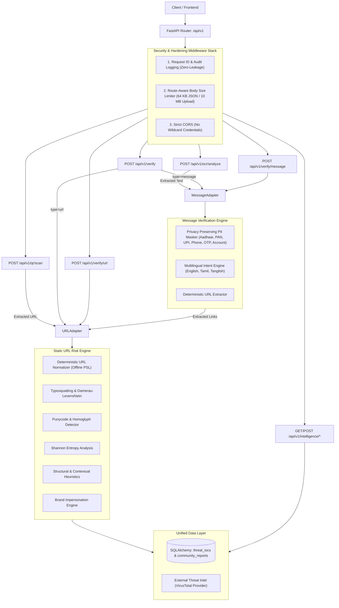

# ZenShield – Unified Cyber-Fraud & Threat Verification Platform

[](https://github.com/zenshield/zenshield-backend/actions/workflows/ci.yml)
[](https://www.python.org/)
[](https://fastapi.tiangolo.com/)
[-brightgreen)](https://pytest.org/)
[](https://pypi.org/project/pip-audit/)

ZenShield 2.0 is a production-grade, privacy-preserving cybersecurity and fraud verification backend. It consolidates four specialized intelligence and detection codebases into a single, highly-hardened FastAPI application built using the modern `src/` layout.

---

## 1. Architectural Overview

ZenShield orchestrates three specialized verification engines and privacy subsystems behind a single entry point:



---

## 2. API Endpoints

All routes are mounted under the configurable prefix `/api/v1` (except system endpoints `/` and `/health`).

| Method | Endpoint | Description | Request Body / Params |
| :--- | :--- | :--- | :--- |
| `GET` | `/` | System status, service identity, and docs link | None |
| `GET` | `/health` | Healthcheck reporting database and engine readiness | None |
| `POST` | `/api/v1/verify` | **Unified Entrypoint**: Verifies URLs or text messages | `{"type": "url"\|"message", "content": "..."}` |
| `POST` | `/api/v1/verify/url` | Direct static URL risk assessment | `{"url": "..."}` |
| `POST` | `/api/v1/verify/message` | Direct SMS/message verification with PII masking | `{"message": "...", "country": "IN", "channel": "sms"}` |
| `POST` | `/api/v1/qr/scan` | OpenCV QR decoder + URL risk inspection | Multipart file (`image/*`, max 10 MB) |
| `POST` | `/api/v1/ocr/analyze` | Tesseract OCR extraction + message risk evaluation | Multipart file (`image/*`, max 10 MB) |
| `GET` | `/api/v1/intelligence/check` | Look up known IOC reputation status | Query: `indicator`, `indicator_type` |
| `POST` | `/api/v1/intelligence/report` | Submit community fraud incident with PII masking | `{"indicator": "...", "threat_type": "...", ...}` |
| `POST` | `/api/v1/report/phishing` | Backward-compatible user fraud reporting | `{"target_url": "...", "category": "phishing", ...}` |
| `GET` | `/api/v1/campaign/stats` | Real campaign statistics aggregated from IOC database | None |

---

## 3. Configuration Reference

ZenShield uses `pydantic-settings` with the `ZENSHIELD_` prefix. Configure via environment variables or a `.env` file (copied from `.env.example`).

| Variable | Default | Description |
| :--- | :--- | :--- |
| `ZENSHIELD_APP_NAME` | `"ZenShield"` | Service identity title |
| `ZENSHIELD_APP_VERSION` | `"2.0.0"` | Application semantic version |
| `ZENSHIELD_ENVIRONMENT` | `"development"` | Runtime environment (`development`, `production`) |
| `ZENSHIELD_DEBUG` | `false` | Debug mode |
| `ZENSHIELD_HOST` | `"0.0.0.0"` | HTTP server binding host |
| `ZENSHIELD_PORT` | `8000` | HTTP server binding port |
| `ZENSHIELD_DATABASE_URL` | `"sqlite:///./zenshield.db"` | Unified SQLAlchemy database connection URI |
| `ZENSHIELD_ALLOWED_ORIGINS` | `"http://localhost:3000,..."` | Comma-separated CORS origins (wildcards reject credentials) |
| `ZENSHIELD_MAX_REQUEST_BODY_BYTES` | `65536` (64 KB) | Maximum JSON payload size |
| `ZENSHIELD_MAX_UPLOAD_SIZE_BYTES` | `10485760` (10 MB) | Maximum multipart image upload size |
| `ZENSHIELD_RATE_LIMIT_PER_MINUTE` | `120` | Client rate limit per minute |
| `ZENSHIELD_VIRUSTOTAL_API_KEY` | `""` | VirusTotal API v3 key (optional) |
| `ZENSHIELD_ENABLE_EXTERNAL_REPUTATION`| `false` | Master toggle for external network queries |
| `ZENSHIELD_ENABLE_LLM_ENRICHMENT` | `false` | Master toggle for Groq LLM secondary analysis |
| `ZENSHIELD_GROQ_API_KEY` | `""` | Groq LLM API Key (optional) |
| `ZENSHIELD_TESSERACT_CMD` | `""` | Path to `tesseract` binary (if not in system PATH) |

---

## 4. Setup & Installation

### Local Virtual Environment

```bash
# 1. Clone repository
git clone https://github.com/zenshield/zenshield-backend.git
cd zenshield-backend

# 2. Create and activate Python >= 3.11 venv
python -m venv .venv
source .venv/bin/activate  # Linux/macOS
# or: .venv\Scripts\Activate.ps1  # Windows

# 3. Upgrade pip and install with development tools
pip install --upgrade pip setuptools
pip install -e ".[dev]"

# 4. Copy configuration
cp .env.example .env
```

### Running Tests & Quality Verification

```bash
# Run all unit and integration tests (209 tests)
pytest tests/ -v

# Run linting and style checks (Ruff)
ruff check src tests
ruff format --check src tests

# Run type checker (Mypy)
mypy src/zenshield

# Run security vulnerability audit
pip-audit
```

### Starting the Server

```bash
uvicorn zenshield.main:app --host 0.0.0.0 --port 8000 --reload
```

Interactive documentation:
- Swagger UI: [http://localhost:8000/docs](http://localhost:8000/docs)
- ReDoc: [http://localhost:8000/redoc](http://localhost:8000/redoc)

---

## 5. Docker Deployment

### Docker Compose (Recommended)

```bash
# Build and run containerized ZenShield backend
docker-compose up -d

# Check health and logs
docker-compose logs -f
curl http://localhost:8000/health
```

### Production Docker Build

```bash
docker build -t zenshield:2.0.0 .
docker run -d -p 8000:8000 --name zenshield zenshield:2.0.0
```

---

## 6. Security & Privacy Guarantees

1. **Zero Raw Content Leakage**: Submitted SMS/message text is scrubbed by the PII masker before logging or returning in HTTP responses.
2. **SSRF Prevention**: URL verification is 100% static. No HTTP requests or socket connections are initiated toward untrusted user-submitted URLs.
3. **Deterministic Offline TLDs**: `tldextract` uses cached offline snapshots (`suffix_list_urls=()`) to eliminate runtime network dependency.
4. **Strict Streaming Limits**: 64 KB JSON and 10 MB image limits are enforced at the ASGI byte stream level, preventing chunked bypass attacks.
5. **Decompression Bomb Protection**: Uploaded images exceeding 4096×4096 px are rejected prior to memory expansion.
